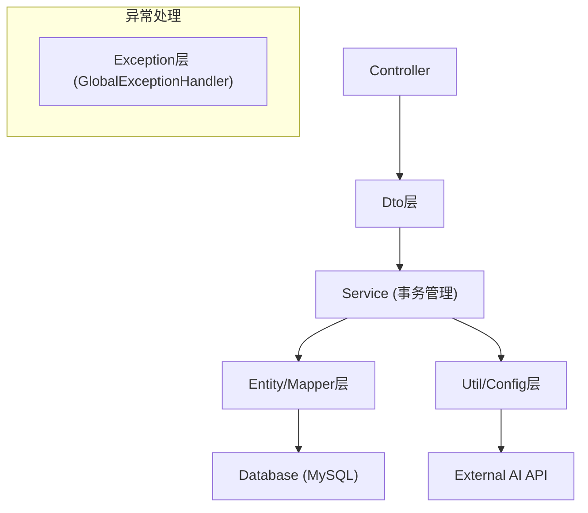
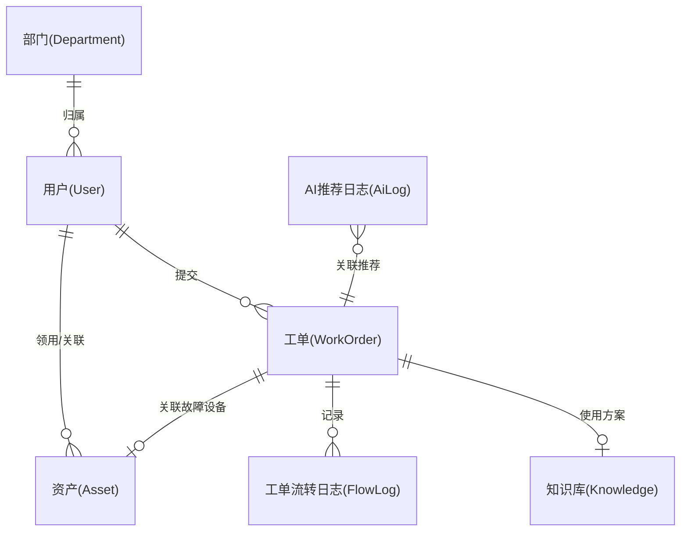

# IT运维综合管理系统 - 技术架构文档

## 1. 架构设计
```mermaid
graph TD
    subgraph 前端层
    A1["Web管理端 (Vue3+ElementPlus+Vite)"]
    A2["PC桌面客户端 (Electron+Vue3)"]
    A3["微信小程序 (UniApp)"]
    end
    
    subgraph 接入层
    B["Nginx / API网关"]
    end
    
    subgraph 后端层 (Spring Boot 3)
    C["Controller (接口层)"]
    D["Service (核心业务)"]
    E["Mapper/Dao (MyBatis-Plus)"]
    F["AI ApiClient (OkHttp代理)"]
    end
    
    subgraph 数据层
    G["MySQL 8.0 (主业务)"]
    H["Redis 6.0 (缓存/防重)"]
    I["MinIO/本地存储 (文件)"]
    end
    
    subgraph 外部服务
    J["阿里云AI (NLP/推荐/预测)"]
    end

    A1 --> B
    A2 --> B
    A3 --> B
    B --> C
    C --> D
    D --> E
    E --> G
    E --> H
    E --> I
    D --> F
    F --> J
```

## 2. 技术栈说明
- **后端**：Spring Boot 3 + Spring Security + MyBatis-Plus 3.5+
- **数据库**：MySQL 8.0 (主数据库) + Redis 6.0+ (缓存、防重放、分布式锁)
- **前端 (Web)**：Vue3 + Element Plus + Vite + ECharts (智慧大屏)
- **客户端**：Electron + Vue3 (PC端), UniApp (微信小程序)
- **中间件/工具**：ZXing (二维码生成)、WebSocket (实时消息推送)、Apache POI (Excel导出)
- **AI集成**：OkHttp 4.10+ (HTTP代理)、Jackson、HMAC-SHA256 (签名加密)、阿里云AI平台 (NLP/智能推荐/时序预测/PAI-EAS)

## 3. 核心路由与接口定义 (基于RESTful)
| 路由/接口前缀 | 模块目的 | 核心操作 |
|-------|---------|---------|
| `/api/v1/auth` | 认证授权 | 用户登录、Token签发与刷新、双Token机制 |
| `/api/v1/work-orders` | 工单管理 | 报修提交、派单、状态流转、接单、超时告警、验收与评价 |
| `/api/v1/assets` | 资产管理 | 资产CRUD、生命周期流转、离线盘点与差异对比、二维码批量生成 |
| `/api/v1/knowledge` | 问题库管理 | 知识词条录入、全文检索、分类归档、审核 |
| `/api/v1/ai` | AI智能接入 | 故障方案推荐、资产故障预测、人力需求预测、知识库优化建议 |
| `/api/v1/dashboard` | 智慧大屏 | 聚合统计工单、资产、AI预测的核心指标及趋势数据 |

## 4. 后端服务器架构图


## 5. 数据模型
### 5.1 数据模型定义 (ER图)


### 5.2 核心数据表结构定义 (DDL摘要)
1. **`user` (用户表)**：包含 `id`, `username`, `password`, `department_id`, `role`, `status`, `last_login_time`
2. **`department` (部门表)**：包含 `id`, `name`, `parent_id`, `sort_order`
3. **`work_order` (工单表)**：包含 `id`, `work_order_code`, `fault_type`, `description`, `urgency_level` (枚举), `status`, `creator_id`, `assignee_id`, `asset_id`, `priority_level`, `sla_deadline`, `auto_assign_rule`, `is_deleted`
4. **`work_order_flow_log` (工单流转表)**：包含 `id`, `work_order_id`, `operator_id`, `action`, `previous_status`, `current_status`, `remark`
5. **`asset` (资产表)**：包含 `id`, `asset_code`, `asset_name`, `category_id`, `serial_number`, `purchase_date`, `status`, `health_status`, `location_id`, `user_id`
6. **`knowledge_base` (问题库表)**：包含 `id`, `fault_type`, `symptom`, `solution`, `ai_generated_flag`
7. **`ai_api_config` (AI配置表)**：包含 `id`, `api_url`, `access_key`, `secret_key`, `timeout_ms`, `retry_count`, `api_type`, `status`
8. **`ai_recommendation_log` (AI推荐记录表)**：包含 `id`, `work_order_id`, `recommended_solution_id`, `confidence_score`, `user_feedback`, `recommendation_accuracy`