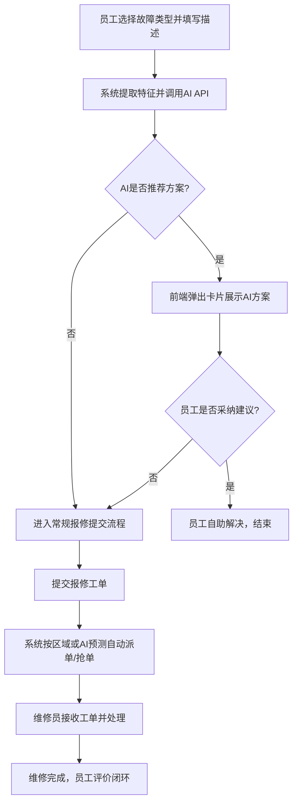

# IT运维综合管理系统 - 产品需求文档 (PRD)

## 1. 产品概述
IT运维综合管理系统是一个旨在提升企业IT运维效率、规范资产管控、降低运维成本的智能化综合平台。
- 整合报修、维修、资产管理、问题库四大核心业务，实现运维全流程闭环管理。
- 支持Web端、PC客户端、微信小程序三端协同。
- 集成智慧可视化数据大屏与AI智能（推荐、预测、分析），提升企业IT管理的智能化水平。

## 2. 核心功能

### 2.1 用户角色
| 角色 | 注册方式 | 核心权限 |
|------|----------|----------|
| 普通员工 | 后台分配/系统导入 | 提交报修、查询工单进度、服务评价、自助排查问题库、查看领用资产 |
| 运维维修员 | 后台分配 | 接单/抢单、填写维修记录、扫码绑定资产、资产盘点、接收AI预警与预测 |
| 管理员 | 后台分配 | 工单流程配置、人员/责任区域划分、资产全台账及二维码管理、AI与大屏配置 |
| 超级管理员 | 系统内置 | 全局配置、角色权限设置、日志审计、数据备份与恢复 |

### 2.2 功能模块
1. **IT故障报修工单系统**：自助报修及AI推荐、多模式接单、工单全流程跟踪管控、超时预警及服务评价。
2. **维修员调度管理**：人员信息维护、区域责任划分、智能工单派发、工作量与业绩统计报表。
3. **IT资产管理**：基于"一物一码"的资产全生命周期管理、二维码批量生成打印、多端扫码与离线盘点。
4. **问题库/故障知识库**：沉淀常见故障解决方案、自助检索排查、结合AI的解决方案智能推荐。
5. **系统基础功能**：RBAC权限精细化管理、组织架构管理、日志审计、统一文件存储、AI API接入配置。
6. **智慧可视化数据大屏**：全局指标监控（用户、资产、工单）、多维数据图表（趋势、分布、排行）、数据钻取。
7. **AI功能模块（API接入）**：AI故障智能推荐、资产与设备故障预警预测、人力需求智能预测。

### 2.3 页面详情
| 页面名称 | 模块名称 | 功能描述 |
|-----------|-------------|---------------------|
| 工作台/大屏页 | 监控大屏 | 实时展示工单、资产、AI预警等指标与图表 |
| 工单报修页 | 自助报修 | 填写故障表单、上传附件，触发并展示AI推荐方案 |
| 工单管理页 | 工单列表 | 工单状态流转操作、接单/抢单、处理详情记录 |
| 资产台账页 | 资产列表 | 资产增删改查、批量导入导出、二维码生成与预览 |
| 问题库管理页 | 知识库 | 解决方案词条的录入、分类管理、AI建议审核 |
| 系统设置页 | 基础配置 | 组织架构、用户角色、AI API参数与降级策略配置 |

## 3. 核心流程
报修与AI推荐主流程：

## 4. 用户界面设计
### 4.1 设计风格
- **主色调**：科技感蓝/青为主，辅以状态警示色（红=紧急/故障、黄=预警、绿=正常/完成）。
- **组件风格**：现代化B端后台组件（如Element Plus），微圆角、轻量阴影、清晰的卡片式分割。
- **字体规范**：无衬线字体，正文清晰易读；数据大屏数字采用科技感/LCD液晶字体增强视觉表现。
- **布局特点**：Web端采用经典侧边栏导航+面包屑+主内容区；大屏采用暗色背景高对比度展示；小程序端采用列表卡片与底部导航栏，注重扫码和一键报修等高频交互。

### 4.2 页面设计概览
| 页面名称 | 模块名称 | UI元素与设计要点 |
|-----------|-------------|-------------|
| 可视化大屏 | 全局监控 | 暗色主题、流光边框、ECharts丰富图表（趋势折线、分布饼图）、实时滚动列表 |
| 工单详情 | 工单处理 | 时间轴组件展示流转日志、分栏卡片隔离基础信息与AI推荐内容、明确的状态标签 |
| 资产详情 | 资产信息 | 包含二维码展示区、资产履历时间轴、健康度（良好/一般/较差）直观色块标识 |

### 4.3 响应式要求
- **Web管理端**：适配主流桌面分辨率（1366x768及以上），复杂表格支持横向滚动与列冻结。
- **PC客户端**：Electron包裹，固定最小宽高，常驻系统托盘并支持右下角消息弹窗。
- **微信小程序**：移动端原生体验，适配各类手机屏幕，触控优化，利用微信原生扫码与相机API。