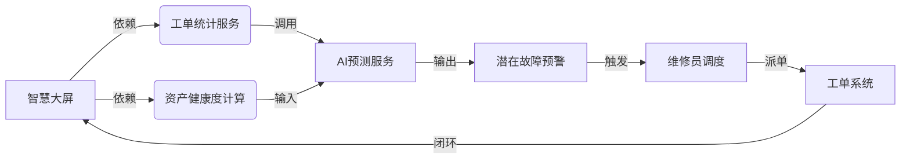

# IT运维综合管理系统 - AI IDE 开发Skill
文档标识：AI_DEV_SKILL_V1.2
生效范围：IT运维综合管理系统全模块开发

## 一、核心目标
确保AI IDE生成的代码满足：
1. 业务闭环一致性（工单→资产→AI→调度→大屏）
2. 技术约束强制性（幂等、安全、降级）
3. 可验证性（自带测试、端到端校验）
4. 可演进性（低成本扩展、兼容未来迭代）

## 二、AI开发核心约束（强制遵循）
### 1. 架构语义约束（不可突破）
#### 核心业务流

#### 编码前置检查清单
- [ ] 当前模块是否属于「工单→维修→评价→知识沉淀→AI优化」核心链路？
- [ ] 修改工单状态时，是否同步更新大屏缓存？
- [ ] Web/PC/小程序端状态是否保持一致？
#### 强制编码规则
- 禁止直接操作数据库表，必须通过Service层
- 所有状态变更需触发事件总线
- 小程序端禁止使用localStorage存储敏感数据

### 2. 领域术语-代码映射（强制映射）
| 业务术语       | 代码实体               | 约束规则                                                                 |
|----------------|------------------------|--------------------------------------------------------------------------|
| 紧急程度       | UrgencyLevelEnum       | 值：1=普通, 2=紧急, 3=特急；禁止用字符串存储                             |
| 资产健康度     | AssetHealthStatus      | 计算公式：health = (1 - (age/total_life)) * 0.6 + repair_count * 0.4；必须用常量表达式 |
| AI推荐方案     | AiRecommendationDTO    | 字段：solutionId, confidence: Double[0.0~1.0], source: "KNOWLEDGE_BASE"/"HISTORICAL_DATA" |
| 逻辑删除       | @TableLogic + is_deleted | 所有查询必须自动过滤 is_deleted=0；实体类必须标注@TableName和@TableField |
#### 编码校验规则
- [ ] 枚举类必须包含code()和desc()方法
- [ ] DTO需用@JsonIgnore隐藏内部字段
- [ ] 外键关联必须用@TableField(exist = false)声明

### 3. 技术约束（硬编码注入）
| 约束类型 | 规则                          | 强制实现代码模板                                                                 |
|----------|-------------------------------|----------------------------------------------------------------------------------|
| 幂等性   | 同一工单重复提交返回原ID      | `@Idempotent(key = "#dto.workOrderCode")`（Controller层）                        |
| 防重放   | AI API调用带timestamp + nonce | `AiApiUtil.generateSignHeader(timestamp, nonce)`（API调用前必加）                 |
| 数据脱敏 | 日志屏蔽手机号/姓名           | `@Sensitive(type = SensitiveType.PHONE)` + AOP切面（实体字段必加）                |
| 降级策略 | AI服务不可用切换人工模式      | 见下方「AI调用降级模板」                                                         |
| SQL注入防护 | 禁止拼接SQL                   | Mapper XML中禁用${}，仅用#{}绑定参数                                            |
| XSS防护   | 响应内容转义                  | Controller层返回前执行`HtmlUtils.htmlEscape(content)`                           |
| 越权访问   | 数据权限控制                  | Service层加`@DataScope(deptAlias = "d")`                                         |

#### 强制代码模板（AI必须直接复用）
```java
// AI服务调用降级模板（禁止修改结构）
public AiRecommendationDTO getRecommendation(WorkOrderCreateDTO dto) {
    try {
        return aiApiClient.call(dto); // 调用AI API
    } catch (AiApiException e) {
        log.warn("AI服务异常，启用降级策略", e);
        return fallbackRecommendation(dto); // 从知识库匹配
    }
}

// 逻辑删除实体模板
@TableName("work_order")
public class WorkOrderEntity {
    @TableId
    private Long id;
    @TableLogic
    private Integer isDeleted; // 0=未删,1=已删
    // 其他字段...
}

// 枚举类模板
public enum UrgencyLevelEnum {
    NORMAL(1, "普通"),
    URGENCY(2, "紧急"),
    EXTREME_URGENCY(3, "特急");

    private final int code;
    private final String desc;

    UrgencyLevelEnum(int code, String desc) {
        this.code = code;
        this.desc = desc;
    }

    public int code() { return code; }
    public String desc() { return desc; }
}
```

### 4. 测试生成约束（强制覆盖）
#### 必须生成的测试类型
| 测试类型   | 覆盖重点                 | 强制用例示例                                                                 |
|------------|--------------------------|------------------------------------------------------------------------------|
| 单元测试   | Service核心逻辑          | testCreateWorkOrder_WhenAiFallback_ShouldReturnKnowledgeSolution()           |
| 集成测试   | 跨模块调用               | testWorkOrderSubmit_TriggerAiAndCacheUpdate()                                |
| 契约测试   | API响应格式              | verifyResponseHasCodeAndTimestamp()（验证code/message/data/timestamp字段）    |
#### 测试覆盖率要求
- 每个Service方法至少1个边界测试用例（空值、超长文本、AI服务异常）
- 测试覆盖率≥80%，无法达到需注明原因并提供替代方案
- 必须模拟AI失败场景：`Mockito.when(aiClient.call()).thenThrow(new TimeoutException())`

### 5. 端到端验证约束
#### 核心用户路径（生成代码前必须验证）
```gherkin
Scenario: 员工提交报修 → AI推荐方案 → 采纳后关闭工单
  Given 员工登录小程序
  When 提交故障描述："打印机卡纸"
  Then 系统显示AI推荐方案："1. 检查进纸托盘 2. 清理卡纸通道（置信度0.92）"
  When 员工点击"采纳建议"并自助解决问题
  Then 工单状态变为"已完成"
  And 大屏实时更新"今日已解决工单+1"
```
#### 验证清单（生成代码后必须回答）
1. 用户操作端（Web/PC/小程序）？
2. 前端→后端数据传输方式（参数/格式/加密）？
3. 后端触发的下游服务（AI/缓存/消息）？
4. 结果反馈给用户的方式（页面/推送/WebSocket）？
5. 异常场景用户感知内容（提示文案/兜底方案）？

### 6. 可演进设计约束
#### 强制采用的扩展模式
| 场景           | 推荐模式               | 代码特征                                                                 |
|----------------|------------------------|--------------------------------------------------------------------------|
| AI服务替换     | 策略模式 + SPI         | `@SPI("baidu_ai") public interface AiService { AiRecommendationDTO recommend(WorkOrderDTO dto); }` |
| 新增故障类型   | 扩展点机制             | 定义FaultTypeExtensionPoint接口，通过SpringFactories动态加载实现类         |
| 大屏指标新增   | 配置化指标引擎         | 指标定义在MetricDefinition.yaml，通过解析器加载                           |
#### 编码要求
- 所有扩展点需在META-INF/spring.factories中注册
- 核心功能需加配置开关（如：`@Value("${ai.enabled:true}")`）
- 废弃接口必须标注`@Deprecated(since = "2.0", forRemoval = true)`

## 三、AI IDE配置模板（直接复用）
### 1. ai_ide_rules.yml（IDE规则配置）
```yaml
generation:
  require_architecture_check: true        # 生成前检查架构一致性
  forbid_raw_sql: true                    # 禁止生成原生SQL
  mandatory_test_coverage: 80%            # 强制测试覆盖率
  security_scan_on_save: true             # 保存时自动安全扫描
validation:
  run_integration_test_before_commit: true # 提交前运行集成测试
  block_if_missing_enum_constant: true    # 缺失枚举常量则阻断生成
```

### 2. AI生成提示词模板（直接复制到IDE）
```
你正在开发【${模块名}】，属于IT运维综合管理系统${核心链路/非核心链路}模块。
请严格遵循以下约束：
1. 架构约束：${当前模块架构依赖说明}
2. 术语映射：所有业务术语必须映射到指定枚举/DTO，禁止自定义值
3. 技术约束：必须包含幂等/降级/安全防护，禁止生成无异常处理的API调用
4. 测试要求：生成代码后配套JUnit 5测试类，覆盖率≥80%
5. 验证要求：生成后验证端到端用户路径，确保数据闭环

生成代码前，请先自检：
- 是否符合架构语义约束？
- 是否遵循领域术语映射规则？
- 是否包含所有强制安全/降级逻辑？
- 是否覆盖边界测试用例？

禁止生成以下代码：
- 直接操作数据库的SQL语句
- 无异常处理、无超时、无降级的REST调用
- 未使用枚举的业务状态值
- 未脱敏的敏感字段日志输出
```

## 四、AI代码评审Checklist（人工+AI双检）
| 检查维度       | 检查项                                                                 | 合规性（是/否） |
|----------------|------------------------------------------------------------------------|----------------|
| 架构一致性     | 是否突破Service层直接操作数据库？                                       |                |
| 术语映射       | 业务状态值是否使用指定枚举？                                           |                |
| 约束实现       | 是否包含幂等/降级/脱敏/防注入逻辑？                                     |                |
| 测试覆盖       | 是否生成单元/集成/契约测试？覆盖率≥80%？                                |                |
| 安全合规       | 是否校验用户输入/权限/JWT？日志是否脱敏？                              |                |
| 可演进性       | 是否预留扩展点/配置开关？                                              |                |
| 端到端验证     | 是否通过核心用户路径验证？                                              |                |

## 五、交付物要求
1. 代码文件：包含业务逻辑+强制约束+注释说明
2. 测试文件：对应单元/集成/契约测试（单独目录）
3. 验证报告：端到端路径验证结果（生成代码时附带）
4. 扩展说明：未来扩展（如切换AI服务商）的修改方案（1句话说明）

## 六、禁用代码清单（绝对禁止生成）
1. `String result = restTemplate.postForObject(url, dto, String.class);`（无异常/降级/超时）
2. Mapper XML中使用`${}`拼接SQL参数
3. 直接使用`System.out.println()`输出日志
4. 小程序端`localStorage.setItem("token", xxx)`存储敏感数据
5. 未标注`@TableLogic`的物理删除代码
6. 无`@Valid`校验的Controller入参
7. 未过滤`is_deleted=0`的查询语句

## 七、版本兼容说明
- 本Skill适配系统V2.0版本，所有生成代码需兼容V1.0存量接口
- 废弃接口需保留兼容层，标注`@Deprecated`并提供迁移方案
- 新增AI服务需通过SPI机制接入，不修改核心业务代码

---
### 使用说明
1. 将本文档作为AI IDE的「项目配置文件」全量导入（Cursor可直接上传为Context文件）；
2. 每个模块开发前，复制「AI生成提示词模板」并替换`${模块名}`等占位符；
3. 代码生成后，用「AI代码评审Checklist」逐项校验；
4. 将「ai_ide_rules.yml」放置在项目根目录，配置IDE自动加载。