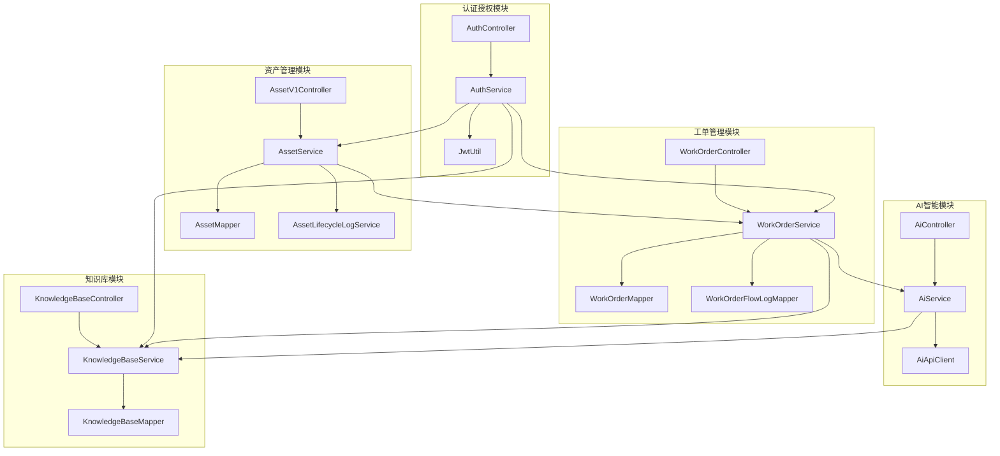
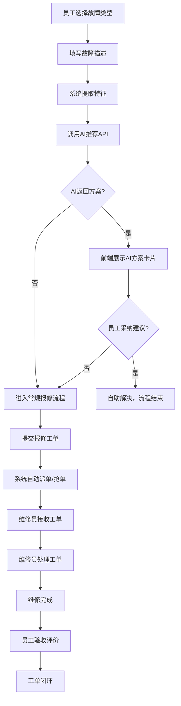
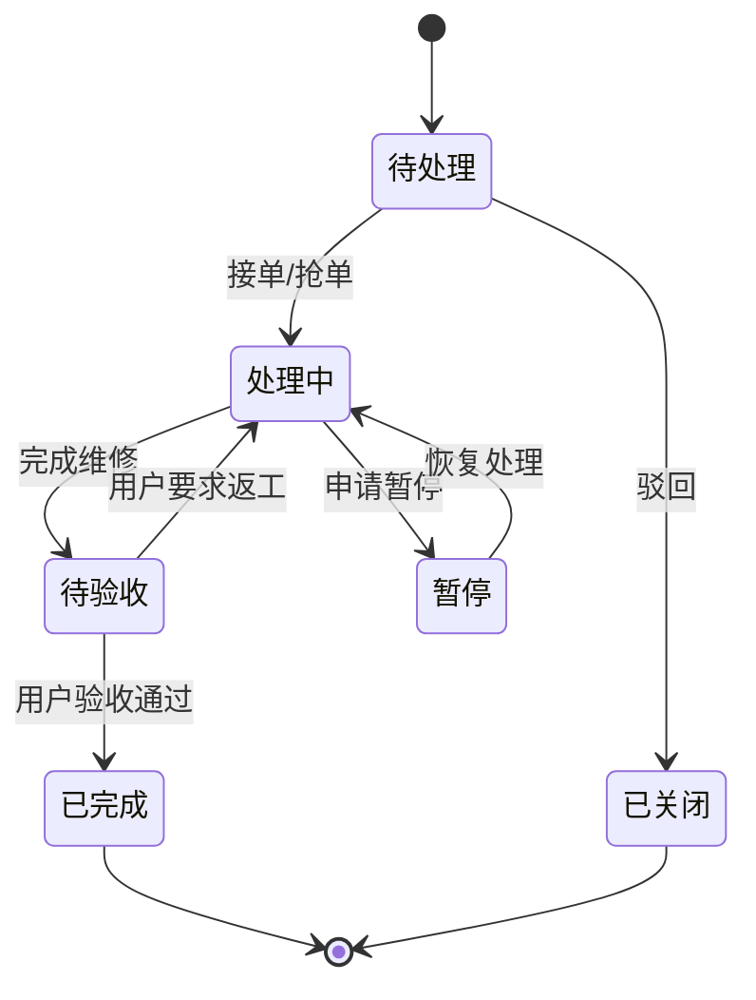
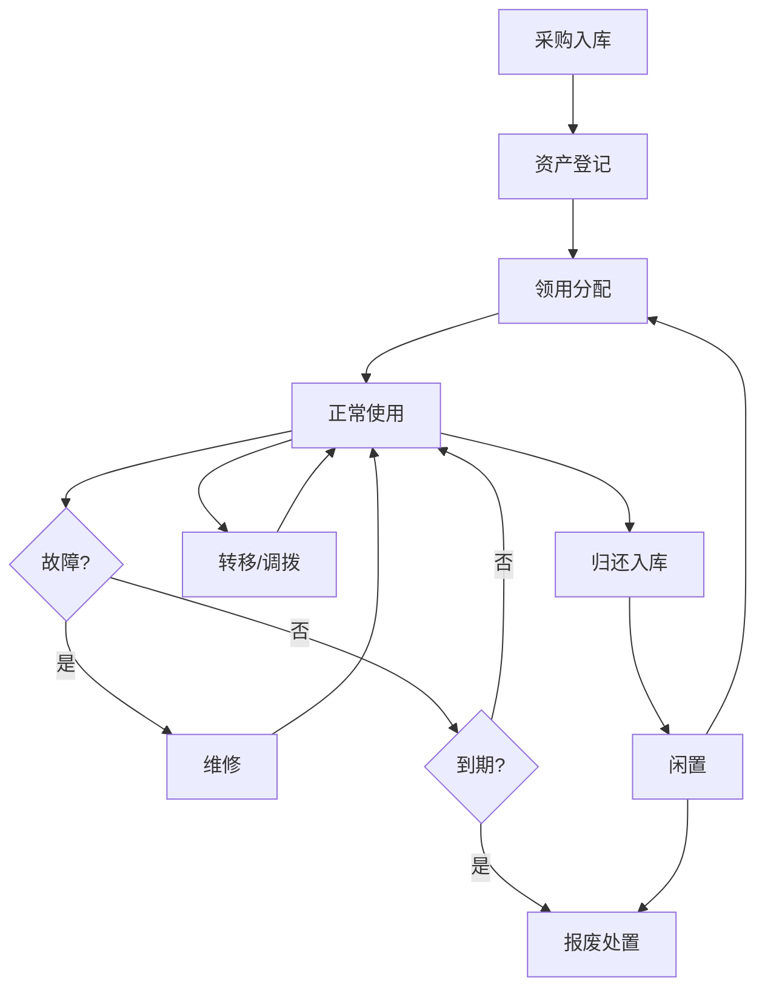
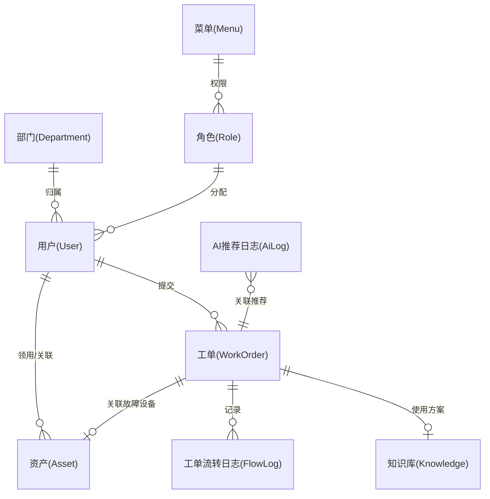

# IT运维综合管理系统 - 项目阶段报告

---

## 一、项目概述

### 1.1 项目定位
**项目名称**：IT运维综合管理系统（ITOMS）

**核心目标**：提升企业IT运维效率、规范资产管控、降低运维成本的智能化综合平台。

**关键特性**：
- 整合报修、维修、资产管理、问题库四大核心业务
- 实现运维全流程闭环管理
- 支持Web端、PC客户端、微信小程序三端协同
- 集成智慧可视化数据大屏与AI智能推荐

### 1.2 技术架构

```mermaid
graph TD
    subgraph 前端层
    A1["Web管理端 (Vue3+ElementPlus+Vite)"]
    A2["PC桌面客户端 (Electron+Vue3)"]
    A3["微信小程序 (UniApp)"]
    end
    
    subgraph 接入层
    B["Nginx / API网关"]
    end
    
    subgraph 后端层 (Spring Boot 3)
    C["Controller (接口层)"]
    D["Service (核心业务)"]
    E["Mapper/Dao (MyBatis-Plus)"]
    F["AI ApiClient (OkHttp代理)"]
    end
    
    subgraph 数据层
    G["MySQL 8.0 (主业务)"]
    H["Redis 6.0 (缓存/防重)"]
    I["MinIO/本地存储 (文件)"]
    end
    
    subgraph 外部服务
    J["阿里云AI (NLP/推荐/预测)"]
    end
    
    A1 --> B
    A2 --> B
    A3 --> B
    B --> C
    C --> D
    D --> E
    E --> G
    E --> H
    E --> I
    D --> F
    F --> J
```

### 1.3 技术栈说明

| 层级 | 技术栈 | 版本 |
|------|--------|------|
| 后端框架 | Spring Boot | 3.x |
| 安全框架 | Spring Security | 6.x |
| ORM框架 | MyBatis-Plus | 3.5+ |
| 数据库 | MySQL | 8.0+ |
| 缓存 | Redis | 6.0+ |
| Web前端 | Vue3 | 3.5+ |
| UI组件 | Element Plus | 2.13+ |
| 构建工具 | Vite | 8.0+ |
| 图表库 | ECharts | 6.0+ |
| 测试框架 | Playwright | 1.59+ |

---

## 二、测试数据与无用数据清理清单

### 2.1 需要清理的文件

| 文件路径 | 文件类型 | 说明 | 建议操作 |
|----------|----------|------|----------|
| `frontend/test-results/` | 目录 | Playwright测试结果（包含失败截图、视频） | **删除** |
| `frontend/playwright-report/` | 目录 | 测试报告生成文件 | **删除** |
| `test_user_management.py` | Python脚本 | 独立测试脚本（非项目集成） | **删除** |
| `db/init.sql` | SQL文件 | 与`simple_init.sql`重复，字段不完整 | **删除** |
| `db/init_full.sql` | SQL文件 | 与`full_init.sql`重复 | **删除** |

### 2.2 清理命令建议

```bash
# 删除前端测试结果
rm -rf frontend/test-results/
rm -rf frontend/playwright-report/

# 删除独立测试脚本
rm test_user_management.py

# 删除重复的数据库脚本
rm db/init.sql
rm db/init_full.sql
```

### 2.3 .gitignore建议追加

```gitignore
# 测试结果目录
test-results/
playwright-report/

# 测试截图
*.png
*.webm

# 独立测试脚本
test_*.py
```

---

## 三、模块实现与逻辑关系

### 3.1 模块划分总览

| 模块名称 | Controller文件 | Service文件 | 核心功能 |
|----------|---------------|-------------|----------|
| 认证授权 | `AuthController.java` | `AuthServiceImpl.java` | 用户登录、Token签发、权限验证 |
| 工单管理 | `WorkOrderController.java`, `WorkOrderV1Controller.java` | `WorkOrderServiceImpl.java` | 工单CRUD、派单、状态流转、SLA预警 |
| 资产管理 | `AssetV1Controller.java`, `AssetApiController.java` | `AssetServiceImpl.java` | 资产CRUD、生命周期管理、二维码生成 |
| AI智能 | `AiController.java` | `AliyunAiServiceImpl.java`, `BaiduAiServiceImpl.java` | 故障推荐、预测、SPI动态加载 |
| 知识库 | `KnowledgeBaseController.java` | `KnowledgeBaseServiceImpl.java` | 知识词条、全文检索、AI审核 |
| 用户管理 | `UserController.java` | `UserServiceImpl.java` | 用户CRUD、角色分配 |
| 角色管理 | `RoleController.java` | `RoleServiceImpl.java` | 角色CRUD、权限配置 |
| 菜单管理 | `MenuController.java` | `MenuServiceImpl.java` | 菜单CRUD、路由配置 |
| 部门管理 | `DepartmentController.java` | `DepartmentServiceImpl.java` | 组织架构管理 |
| 系统字典 | `SysDictController.java` | `SysDictServiceImpl.java` | 字典配置管理 |
| 参数配置 | `SysConfigController.java` | `SysConfigServiceImpl.java` | 系统参数管理 |
| 操作日志 | `OperationLogController.java` | `OperationLogServiceImpl.java` | 日志审计 |

### 3.2 模块依赖关系图



---

## 四、业务依赖关系

### 4.1 模块依赖矩阵

| 模块 | 依赖模块 | 被依赖模块 |
|------|----------|------------|
| 认证授权 | 无 | 所有模块 |
| 工单管理 | AI智能、知识库、资产管理 | 大屏监控 |
| 资产管理 | 部门管理、用户管理 | 工单管理 |
| AI智能 | 知识库 | 工单管理 |
| 知识库 | 无 | AI智能、工单管理 |
| 用户管理 | 角色管理、部门管理 | 工单管理、资产管理 |
| 角色管理 | 菜单管理 | 用户管理 |
| 部门管理 | 无 | 用户管理、资产管理 |
| 系统管理 | 无 | 所有模块 |

### 4.2 核心业务流程

#### 报修与AI推荐流程



#### 工单状态流转



#### 资产全生命周期流程



---

## 五、数据交互逻辑

### 5.1 数据库表关系图



### 5.2 核心数据表结构

#### 用户表 (`user`)

| 字段名 | 类型 | 说明 |
|--------|------|------|
| `id` | BIGINT | 主键ID |
| `username` | VARCHAR(50) | 用户名/登录名 |
| `password` | VARCHAR(255) | 密码(BCrypt加密) |
| `real_name` | VARCHAR(50) | 真实姓名 |
| `department_id` | BIGINT | 所属部门ID |
| `role` | VARCHAR(50) | 角色(USER, REPAIRMAN, ADMIN, SUPER_ADMIN) |
| `status` | TINYINT | 状态(0-禁用, 1-启用) |
| `is_deleted` | TINYINT | 逻辑删除标志 |

#### 工单表 (`work_order`)

| 字段名 | 类型 | 说明 |
|--------|------|------|
| `id` | BIGINT | 主键ID |
| `work_order_code` | VARCHAR(50) | 工单编号 |
| `fault_type` | VARCHAR(50) | 故障类型 |
| `description` | TEXT | 问题描述 |
| `urgency_level` | TINYINT | 紧急程度(1-普通, 2-紧急, 3-特急) |
| `status` | TINYINT | 状态(1-待处理, 2-处理中, 3-待验收, 4-已完成, 5-已关闭) |
| `creator_id` | BIGINT | 报修人ID |
| `assignee_id` | BIGINT | 维修人ID |
| `asset_id` | BIGINT | 关联资产ID |
| `sla_deadline` | DATETIME | SLA截止时间 |

#### 资产表 (`asset`)

| 字段名 | 类型 | 说明 |
|--------|------|------|
| `id` | BIGINT | 主键ID |
| `asset_code` | VARCHAR(50) | 资产编号 |
| `asset_name` | VARCHAR(100) | 资产名称 |
| `category_id` | BIGINT | 资产分类ID |
| `status` | TINYINT | 状态(1-在用, 2-闲置, 3-维修, 4-报废) |
| `health_status` | VARCHAR(20) | 健康度(GOOD, NORMAL, POOR) |
| `user_id` | BIGINT | 使用人ID |
| `department_id` | BIGINT | 归属部门ID |

#### 知识库表 (`knowledge_base`)

| 字段名 | 类型 | 说明 |
|--------|------|------|
| `id` | BIGINT | 主键ID |
| `fault_type` | VARCHAR(50) | 故障类型 |
| `symptom` | TEXT | 故障现象 |
| `solution` | TEXT | 解决方案 |
| `ai_generated_flag` | TINYINT | 是否AI生成(0-人工, 1-AI) |

### 5.3 API接口清单

#### 认证授权接口

| 接口路径 | HTTP方法 | 功能描述 |
|----------|----------|----------|
| `/api/v1/auth/login` | POST | 用户登录 |
| `/api/v1/auth/logout` | POST | 用户登出 |
| `/api/v1/auth/refresh` | POST | Token刷新 |

#### 工单管理接口

| 接口路径 | HTTP方法 | 功能描述 |
|----------|----------|----------|
| `/api/work-order/create` | POST | 创建工单 |
| `/api/work-order/{id}` | GET | 获取工单详情 |
| `/api/work-order/list` | GET | 获取工单列表 |
| `/api/work-order/assign` | POST | 人工派单 |
| `/api/work-order/auto-assign/{id}` | POST | 自动派单 |
| `/api/work-order/grab` | POST | 抢单 |
| `/api/work-order/process` | POST | 处理工单 |
| `/api/work-order/finish` | POST | 完成工单 |
| `/api/work-order/evaluate` | POST | 评价工单 |

#### 资产管理接口

| 接口路径 | HTTP方法 | 功能描述 |
|----------|----------|----------|
| `/api/v1/assets` | GET | 获取资产列表 |
| `/api/v1/assets` | POST | 创建资产 |
| `/api/v1/assets/{id}` | PUT | 更新资产 |
| `/api/v1/assets/{id}` | DELETE | 删除资产 |
| `/api/v1/assets/{id}/receive` | POST | 领用资产 |
| `/api/v1/assets/{id}/transfer` | POST | 转移资产 |
| `/api/v1/assets/{id}/repair` | POST | 维修资产 |
| `/api/v1/assets/{id}/scrap` | POST | 报废资产 |

#### AI智能接口

| 接口路径 | HTTP方法 | 功能描述 |
|----------|----------|----------|
| `/api/v1/ai/recommend` | POST | 获取故障推荐方案 |

---

## 六、项目阶段说明

### 6.1 已完成阶段

| 阶段 | 状态 | 完成内容 | 完成时间 |
|------|------|----------|----------|
| 基础架构搭建 | ✅ | Spring Boot + Vue3项目初始化、数据库设计 | 已完成 |
| 认证授权模块 | ✅ | JWT认证、Spring Security配置、用户登录/登出 | 已完成 |
| 工单管理模块 | ✅ | 工单CRUD、状态流转、派单抢单、SLA超时预警 | 已完成 |
| 资产管理模块 | ✅ | 资产CRUD、生命周期管理、二维码生成 | 已完成 |
| AI集成模块 | ✅ | 阿里云AI接入、故障推荐API、SPI动态加载 | 已完成 |
| 系统管理模块 | ✅ | 用户、角色、菜单、部门、字典、参数管理 | 已完成 |
| 智慧大屏模块 | ✅ | ECharts图表、实时数据展示、统计指标 | 已完成 |

### 6.2 进行中阶段

| 阶段 | 状态 | 进度 | 待完成内容 |
|------|------|------|----------|
| 小程序开发 | ⚠️ | 60% | 扫码报修、工单查询、资产盘点功能完善 |
| PC客户端 | ⚠️ | 30% | Electron打包配置、托盘消息通知 |
| 测试用例 | ⚠️ | 40% | Playwright测试用例完善、自动化测试集成 |

### 6.3 待规划阶段

| 阶段 | 状态 | 预计开始时间 | 主要内容 |
|------|------|--------------|----------|
| 性能优化 | ⏳ | 下一阶段 | Redis缓存策略、数据库索引优化、接口性能优化 |
| 日志审计 | ⏳ | 下一阶段 | 完善操作日志记录、日志查询分析、数据脱敏 |
| 移动端优化 | ⏳ | 后续阶段 | 小程序性能优化、离线功能支持 |

---

## 七、代码优化建议

### 7.1 前端路由问题

**问题位置**：`backend/src/main/java/com/company/itoms/controller/WorkOrderController.java:122`

```java
Long currentUserId = 1L; // 假设当前用户ID为1，实际应该从JWT中获取
```

**问题分析**：硬编码用户ID，生产环境无法正确获取当前登录用户

**优化建议**：从Spring Security的SecurityContext中获取当前用户信息

```java
// 优化后代码
Authentication authentication = SecurityContextHolder.getContext().getAuthentication();
Long currentUserId = Long.parseLong(authentication.getName());
```

### 7.2 数据库脚本冗余

**问题**：`db/`目录下存在多个重复的初始化脚本

**优化建议**：
1. 保留`full_init.sql`作为主脚本
2. 删除`init.sql`和`init_full.sql`
3. 创建`README.md`说明各脚本用途

### 7.3 测试资源管理

**问题**：`test-results/`和`playwright-report/`目录包含大量测试截图和视频

**优化建议**：
1. 将测试结果目录加入`.gitignore`
2. 清理现有测试结果文件
3. 配置CI/CD时自动清理测试结果

### 7.4 错误处理优化

**问题**：部分Controller方法缺少参数校验和异常处理

**优化建议**：
1. 统一使用`@Validated`注解进行参数校验
2. 全局异常处理器统一处理异常
3. 增加业务异常类，提供更详细的错误信息

---

## 八、总结

### 8.1 项目完成度评估

| 维度 | 评分 | 说明 |
|------|------|------|
| 架构设计 | 90% | 技术架构清晰，模块划分合理 |
| 核心功能 | 85% | 工单、资产、认证等核心功能已完成 |
| 代码质量 | 80% | 存在少量硬编码和冗余代码 |
| 文档完善度 | 75% | 架构文档和PRD文档完善，代码注释需补充 |
| 测试覆盖 | 60% | Playwright测试用例需完善 |

### 8.2 下一步建议

1. **清理冗余文件**：按照第二章的清理清单执行清理操作
2. **修复代码问题**：处理第三章提到的代码优化项
3. **完善测试用例**：补充Playwright测试用例，提高测试覆盖率
4. **推进小程序开发**：完成小程序端核心功能开发
5. **性能优化**：实施Redis缓存策略，优化数据库查询

---

**报告生成时间**：2026-04-28
**项目版本**：v1.0.0
**报告状态**：正式版